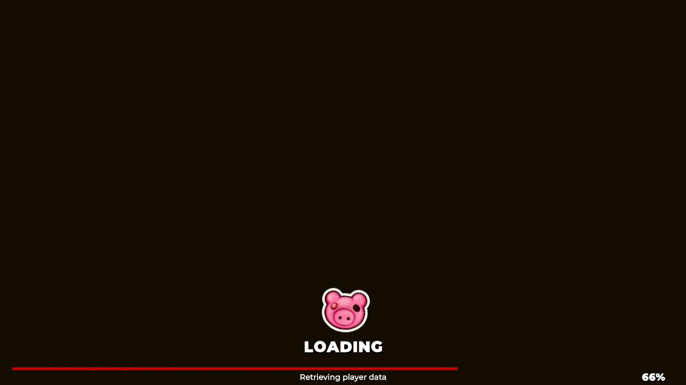

# Piglet Hunt
The first open-source private server for the abandoned Steam game PIGGY: Hunt

### IMPORTANT NOTE: At the moment, the client will only reach 66% but I will soon fix the problem in the future. 

---

## Requirements     

Make sure you have the following installed:

- UwAmp Wamp Server [(Download)](https://www.uwamp.com/file/UwAmp.exe)
- HxD [(Download)](https://mh-nexus.de/en/hxd/)
- dnSpy [(Download)](https://dnspy.org/)
- PIGGY: Hunt Client [(Download)](https://mega.nz/folder/1qt02byb#ZxDqEQh3sZLvNCPRpeY4yw)

---

## UwAmp Setup

1. Download and install **UwAmp**.

2. Launch **UwAmp**.

3. Start the **Apache** service.

4. Navigate to:

   ```
   C:\UwAmp\www
   ```

5. Copy all files from this repository into the **www** folder.

6. Ensure that Apache is running and accessible on port **80** (HTTP) or **443** (HTTPS).

7. Verify your setup by opening your server URL in a web browser.

---

## Application Setup

* In your **PIGGY: Hunt** application folder, navigate to **piggy-hunt_Data** and open **resources.assets** in a hex editor (such as HxD). Replace **api.beamable.com** with your own URL. If your URL is shorter than the original, pad the remaining space with forward slashes (`/`). If the client does not connect and your web server is not using **HTTPS**, change your URL to use **http** instead of **https**.

* Open the **Managed** folder located inside **piggy-hunt_Data** and open **PubNub.dll** in **dnSpy**. Press **Ctrl + Shift + K**, set the "Search For:" to **Number/String**, and search for **pubsub.pubnub.com**. Double-click the result, then right-click the URL and select **Edit Class (C#)**. Replace it with your own URL, then click **Compile**. Finally, click **File** in the top-left corner and select **Save All** to save your changes.

* Finally, you can launch the exe and you should connect to our own PIGGY: Hunt server!

---

## Screenshots

<details>
  <summary>Click to view screenshots</summary>

  

</details>

---

## Disclaimer
**Piglet Hunt** uses resources from the APIs of **Beamable/Disruptor Beam** and is not affiliated with **MiniToon**, **Shaggy Doge**, **Beamable/Disruptor Beam**.
All rights to Piggy, Piggy: Intercity, and PIGGY: Hunt belong to their respective owners.

If a takedown is requested by the original developers, this repository will be removed.
